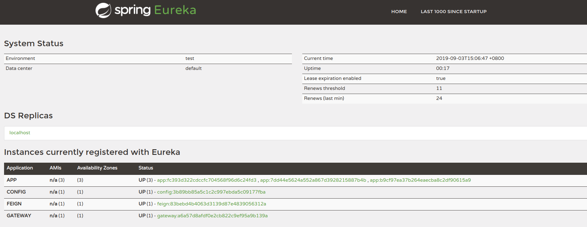
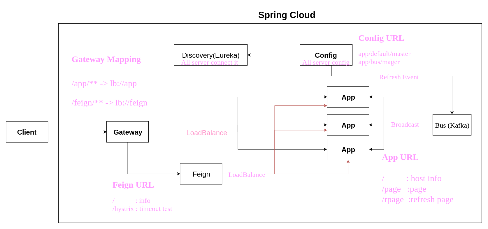

# Spring Cloud Sample 
> This is a simple project allows you to view the basic spring cloud service .
> Inlude Gateway , Discovery(Eureka) , Bus , Config , Feign

---

## Follow step 
0. ### Start the server 

		gradle  SpringCloudRun 

0. ### Open the URL
	Eureka Server : <http://localhost:8082/>

0. ### You can find all service 
	

0. ### try some link
	Gateway (app)   : <http://localhost:8080/app/>    
	Gateway (feign) : <http://localhost:8080/feign/>   
	Config          : <http://localhost:8081/app/bus/master/>   

---
## The microservice flow is like below  
