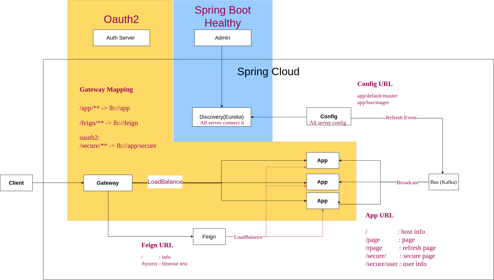

# Spring Cloud Sample 
> This is a simple project allows you to view the basic spring cloud service .  
> Inlude Gateway , Discovery(Eureka) , Bus , Config , Feign , security(oauth2) , Admin 

---

## Follow step 
+  ### Start the server 

		gradle  SpringCloudRun 

+  ### stop the server 

>  control + C (Window doesn't work)  
>  shutdown service <http://localhost:9999/shutdown>  

> where gradle can't trigger shutdownhook in Windows.   

+ ### Find the service 

**you can use Eureka .**    
	Eureka Server : <http://localhost:8082/>  
	

**or more powerful UI , Admin .**  
	Admin Server : <http://localhost:9000/>
	
	

+ ### try some link
	Gateway (app)   : <http://localhost:8080/app/>    
	Gateway (feign) : <http://localhost:8080/feign/>   
	Config          : <http://localhost:8081/app/bus/master/>   

---
## The microservice flow is like below  

##Module Intro
preparing 